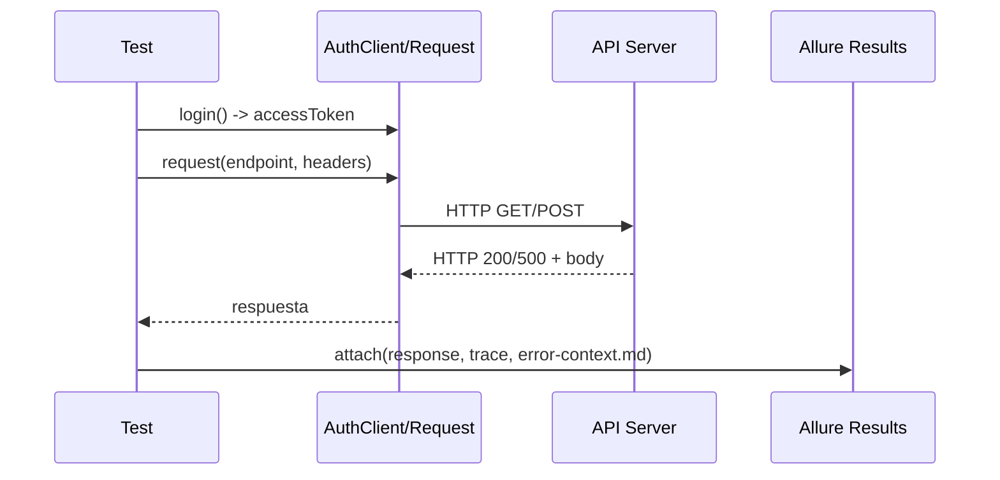

# Totalplay — Datadog Tests

**Resumen**
- **Qué:** Suite de pruebas end-to-end basadas en Playwright y pruebas API (TypeScript) enfocadas en endpoints de dashboards y autenticación.
- **Dónde:** El código de pruebas vive en la carpeta [datadog-tests](datadog-tests).

**Estructura principal**
- [datadog-tests](datadog-tests): pruebas, resultados y configuración de Playwright.
	- [datadog-tests/tests/api](datadog-tests/tests/api): especificaciones API (DB-05..DB-08, etc.)
	- [datadog-tests/test-results](datadog-tests/test-results): artefactos de ejecución (logs, traces, error-context.md)
	- [datadog-tests/allure-report](datadog-tests/allure-report): reporte HTML generado por Allure

**Objetivo del repositorio**
- Ejecutar pruebas API y UI con Playwright.
- Generar reportes Allure con trazas y adjuntar logs de errores para validación.

**Prerequisitos**
- Node.js (v16+ recomendado) y npm.
- `npx`/`npm` disponible en PATH.
- Java (JRE) sólo si usas una instalación global de Allure CLI; la dependencia `allure-commandline` está incluida en `datadog-tests/package.json` y suele ser suficiente.

**Instalación rápida**
1. Abrir el workspace raíz del proyecto.
2. Instalar dependencias para las pruebas:

```bash
cd datadog-tests
npm install
```

3. (Opcional) Preparar Playwright browsers la primera vez:

```bash
npx playwright install
```

**Ejecutar pruebas**
- Ejecutar toda la suite de pruebas:

```bash
cd datadog-tests
npm run test
```

- Ejecutar sólo pruebas API:

```bash
npm run test:api
```

- Ejecutar un archivo de prueba específico (ejemplo):

```bash
npx playwright test tests/api/dashboards-servicio-iptv.spec.ts --reporter=list
```

**Generar y abrir reporte Allure**
- Para generar el reporte Allure (usa `allure-results` existentes):

```bash
cd datadog-tests
npm run allure:generate
```

- Abrir el reporte generado en el navegador:

```bash
npm run allure:open
# o
open allure-report/index.html
```

- Servir temporalmente (Allure sirve y abre automáticamente):

```bash
npm run allure:serve
```

**Dónde están los logs y artefactos**
- Resultados y attachments (trazas/playwright trace) se guardan en: [datadog-tests/test-results](datadog-tests/test-results)
- Repositorio del reporte Allure en: [datadog-tests/allure-report](datadog-tests/allure-report)
- Ya empaquetado (reporte + logs) en: [datadog-tests/allure-report-with-logs.zip](datadog-tests/allure-report-with-logs.zip)

**Diagrama — Arquitectura de ejecución (mermaid)**

```mermaid
flowchart TD
	A[Developer / CI] --> B[Playwright test runner]
	B --> C{Test types}
	C --> C1[API tests (tests/api)]
	C --> C2[UI tests (tests/ui)]
	C1 --> D[Requests via AuthClient -> API endpoints]
	D --> E[Responses & assertions]
	E --> F[allure-results (attachments, traces)]
	F --> G[allure generate -> allure-report]
	G --> H[HTML report / ZIP]
```

**Diagrama — Flujo de un caso de prueba (mermaid sequence)**



**Buenas prácticas y recomendaciones**
- Reintentos: para endpoints inestables (5xx) usar reintentos y backoff (ya aplicados en `dashboards-servicio-iptv.spec.ts`).
- Tolerancia: cuando el backend puede devolver esquemas parciales, usar aserciones tolerantes (ej. `>= N` métricas presentes).
- Logging: capturar `response.text()` y guardar en `error-context.md` dentro de `test-results/<run-folder>/` para diagnóstico.

**Comandos útiles resumen**
- Instalar dependencias:

```bash
cd datadog-tests
npm install
```

- Ejecutar pruebas API:

```bash
npm run test:api
```

- Generar Allure report:

```bash
npm run allure:generate
```

- Abrir Allure report:

```bash
npm run allure:open
```

**Resolución de problemas**
- Si `allure:generate` no produce `allure-report`:
	- Verifica que existan archivos en `datadog-tests/allure-results`.
	- Re-run de pruebas con attachments: `npx playwright test --retries=0 --reporter=list`.
- Si faltan dependencias o fallan `npm install`, revisa la versión de Node y permisos de npm.

---

Si quieres, puedo:
- Añadir ejemplos concretos de `npx playwright test` con `--grep` y `--output`.
- Crear un script `make report` o `scripts/ci.sh` para CI.

Dime cuál prefieres y lo implemento.

**Diagrama rápido — Workflow de pruebas (mermaid)**

```mermaid
flowchart LR
	Dev[Developer / CI] -->|run tests| PW[Playwright Runner]
	PW -->|api/ui tests| Tests{Test Suites}
	Tests --> API[API tests (tests/api)]
	Tests --> UI[UI tests (tests/ui)]
	API --> Auth[AuthClient -> obtiene token]
	API --> Req[Request -> API endpoints]
	Req --> Resp[Response (200/4xx/5xx)]
	Resp --> Assertions[Assertions & attachments]
	Assertions --> AR[allure-results (attachments, traces, error-context.md)]
	AR -->|generate| AG[allure generate]
	AG --> Report[allure-report (HTML)]
	Report --> ZIP[allure-report-with-logs.zip]
	Dev -->|inspect| Report
	Dev -->|download| ZIP
```
